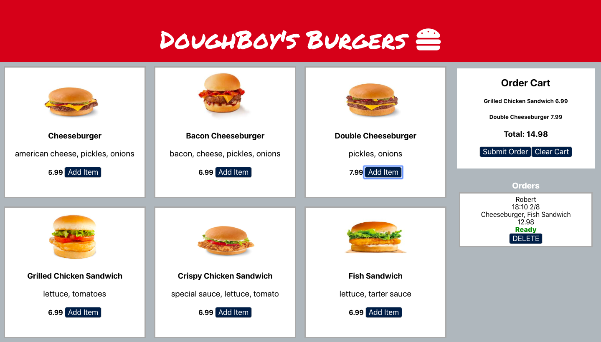

# restpro3/Doughboy's Burgers

Doughboy's Burgers was created in React to demonstrate my ability to write a full stack web application.

This application will allow a user to log in and choose items from the menu. 
Currently the app is non secure and does not require a password. 

Once logged in, a user can select items from the menu.  When an item is selected it is added to the order cart and the total is calculated.  The order is submitted from the cart and will render to the My Orders section as well as the admin view using socket.io.

The admin view is accessed by logging in as admin.  Currently the username "admin" will direct user to the admin view.
The admin is able to view all orders submitted in real time.  The admin clicks the check box when order is completed.  When the admin clicks box to confirm order is completed, the order will change from "preparing" to "ready" in the my order section of the menu-order view.

Below are images of each view:

